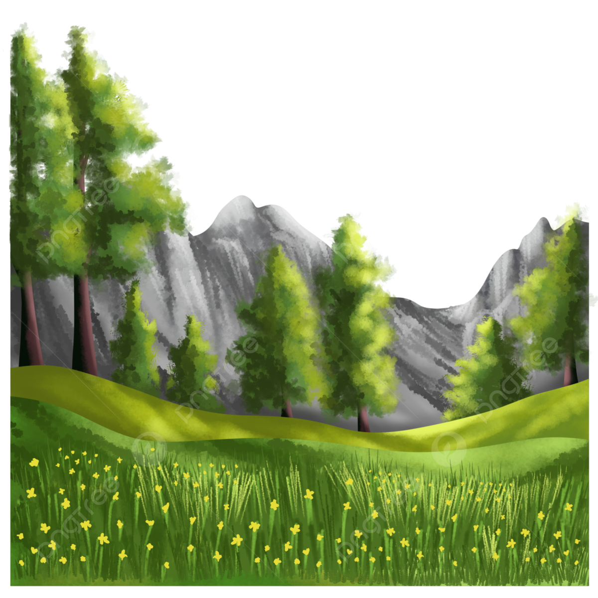

# 設計此專案介紹

## 語法選擇
 
### 1.makedown
 [makedoen教學網址](https://cnfox.github.io/2019/05/21/Makedown-language/)
 #### 建立連接最前方需要空格
### 2.基礎HTML
<h1> 測試外部連接 </h1>
 [yahoo](http://tw.yahoo.com)

<h1> 測試顯示圖片 </h1>
 </a>

